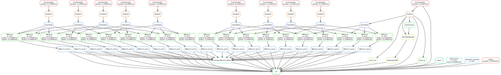

```{r setup, include=FALSE}
knitr::opts_chunk$set(echo = FALSE, comment = '')
library(yaml)
config <- yaml.load_file('../config.yaml')
env <- yaml.load_file('environment.yml')

version <- function(x) {
  strsplit(grep(paste0('^',x), env$dependencies, value = T), '=')[[1]][2]
}
```

## 1. Basic Information
```{r}
cat('Species:', config$species)
cat('Genome assembly:', rev(strsplit(config$index, '/')[[1]])[2])
cat('Sequencing Type:', config$seq_info$type)
cat('Sequencing Mode:', config$seq_info$mode)
cat('Replication number:', config$seq_info$replicate)
```

## 2. Sample Information
```{r}
data.frame(sample_names = config$samples)
data.frame(sample_info = unlist(config$sample_info))
```

## 3. Workflow


## 4. Results
### 4.1 Reads quality
We used **FastQC** (version `r version('fastqc')`) to check the sequencing quality. 

- [Output of FastQC](../fastqc)

### 4.2 Trim adapter sequence
We used **Trimmomatic** (version `r version('trimmomatic')`) to trim the adapter sequences. 

- [Output of Trimmomatic](../clean)

### 4.3 Reads mapping
We used **bowtie2** (version `r version('bowtie2')`) to map the clean reads. The multiple mapped reads were discarded by **samtools** (version `r version('samtools')`). We also checked the mapping quality by **qualimap** (version `r version('qualimap')`) 

- [Output of bowtie2 and qualimap](../bam)

### 4.4 IGV tracks 
We used **bedtools** (version `r version('bedtools')`) and **igvtools** (version `r version('igvtools')`) to generate normalized read profiles (Reads per Million) for each sample. The tdf files must be viewed in [IGV](http://software.broadinstitute.org/software/igv/). 

- [Tracks](../track)

### 4.5 Peak calling
We used **MACS** (version 1.4) to identify the enriched peaks (Input sample as control). In some cases, we can't get enough peaks using the default *p*-value cutoff (1e-5). As a result, we also used a less stringent *p*-value cutoff (1e-2) to include more peaks which are not very reliable. We annotated peaks by the nearest genes and the GO terms of the corresponding genes by **ChIPseeker** (version `r version('bioconductor-chipseeker')`).

- [Idenified peaks ( *p*-value < 1e-5 )](../peak_1e-5)
- [Idenified peaks ( *p*-value < 1e-2 )](../peak_1e-2)

### 4.6 Sample quality
We check the sample quality by two methods: correlation heatmap and PCA plot. All the figures are generated by **diffBind** (version `r version('bioconductor-diffbind')`)

#### 4.6.1 Correlation heatmap
- [correlation of peak score ( *p*-value < 1e-5 )](../figure/peak_1e-5_correlation_heatmap_peak_score.pdf)
- [correlation of peak score ( *p*-value < 1e-2 )](../figure/peak_1e-2_correlation_heatmap_peak_score.pdf)
- [correlation of peak read counts ( *p*-value < 1e-5 )](../figure/peak_1e-5_correlation_heatmap_read_count.pdf)
- [correlation of peak read counts ( *p*-value < 1e-2 )](../figure/peak_1e-2_correlation_heatmap_read_count.pdf)

#### 4.6.2 PCA plot
- [PCA plot ( *p*-value < 1e-5 )](../figure/peak_1e-5_PCA.pdf)
- [PCA plot ( *p*-value < 1e-2 )](../figure/peak_1e-2_PCA.pdf)

### 4.7 Peak overlaps 
We checked the number of overlapped peaks among different samples. All the figures are generated by **diffBind** (version `r version('bioconductor-diffbind')`).

- [Venn plot ( *p*-value < 1e-5 )](../figure/peak_1e-5_overlap.pdf)
- [Venn plot ( *p*-value < 1e-2 )](../figure/peak_1e-2_overlap.pdf)

### 4.8 Differentially binding peaks
```{r}
if (config$seq_info$replicate == 1) {
  tools <- 'MAnorm'
  tools_v <- version('manormfast')
  dbp1 <- '../table/all_peak_1e-5_MAvalues_anno.xlsx'
  dbp2 <- '../table/all_peak_1e-2_MAvalues_anno.xlsx'
} else {
  tools <- 'DESeq2'
  tools_v <- version('bioconductor-deseq2')
  dbp1 <- '../table/peak_1e-5_diff_test_anno.xlsx'
  dbp2 <- '../table/peak_1e-2_diff_test_anno.xlsx'
}
```
We used **`r tools`** (version `r tools_v`) to identify differentially binding peaks. We annotated DBPs by the nearest genes and the GO terms of the corresponding genes by **ChIPseeker** (version `r version('bioconductor-chipseeker')`).

- [DBP list ( *p*-value < 1e-5 )](`r dbp1`)
- [DBP list ( *p*-value < 1e-2 )](`r dbp2`)

